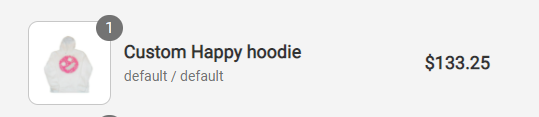

# BinItem

This component is used in **Cart.js** page to show the items a user added to his bin.

## Props

| Prop Name | Type   | Default value    | Description                   |
|-----------|--------|------------------|-------------------------------|
| name      | string | 'AWESOME HOODIE' | The name of an item           |
| price     | number | 999              | The price                     |
| amount    | number | 1                | Quantity of the items         |
| option    | string | 'XS / White'     | Size and color                |
| img       | string | 'none'           | Path to image, has to be full |
