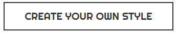

# Button



Basically a button with black border.

## Props

| Prop Name | Type   | Default value  | Description |
|-----------|--------|----------------|-------------|
| click     | func   | ```() => {}``` | Click event |
| children  | string | 'Button'       | The label   |
