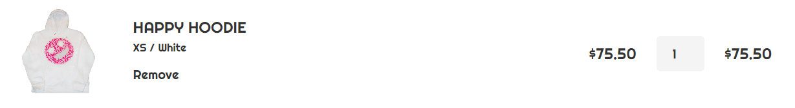

# CartItem



Item stored in a bin. Here you can modify either change amount or remove item from the bin at all.

## Props

| Prop Name | Type   | Default value | Description         |
|-----------|--------|---------------|---------------------|
| img       | string | 'default'     | Path to image       |
| name      | string | 'Hoodie'      | The name of an item |
| price     | number | 999           | The price           |
| option    | string | 'None / None' | The size and color  |
| quantity  | number | 1             | Amount of items     |
| id        | string | 'none'        | Item's id           |

## State

| Prop Name | Type   | Default value | Description        |
|-----------|--------|---------------|--------------------|
| valueQ    | number | 1             | Amount of an items |

## Functions

### removeItem

Removes item from a redux store.

```js
 function removeItem() {
    dispatch({ type: "cart/removeElement", payload: { _id: id } });
  }
```

### changeValue

Changes amount of the item both in the redux store and in the component itself. Also you cannot make amount less than 1 item.

```js
 function changeValue({ target: { value } }) {
    if (value > 0) {
      dispatch({ type: "cart/changeAmount", payload: { _id: id, number: Number(value) } });
      setValueQ(value);
    }
    else {
      dispatch({ type: "cart/changeAmount", payload: { _id: id, number: 1 } });
      setValueQ(1);
    }
  }
```
