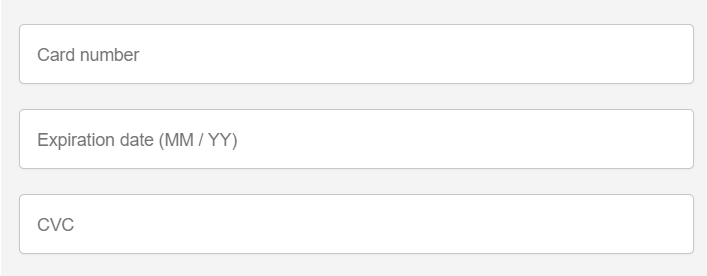

# CheckoutForm



Stripe form to serve payments. Used at the final stage of a payment.

## Props

| Prop Name     | Type   | Description                                   |
|---------------|--------|-----------------------------------------------|
| successFunc   | func   | Function fires on the success                 |
| setWaiting    | func   | Function fires while waiting for the response |
| totalPrice    | number | The price                                     |
| fN            | string | First name                                    |
| lN            | string | Last name                                     |
| email         | string | User's data                                   |
| postal        | string | User's data                                   |
| country       | string | User's data                                   |
| city          | string | User's data                                   |
| items         | string | All items in the cart                         |
| address       | string | User's data                                   |
| actualBilling | string | Billing address                               |
| details       | string | Details                                       |
| shipping      | string | Company to ship the parcel                    |
| setSuccess    | func   | Success setter                                |

## Functions

### handleSubmit

Handles all the logic under the hood of the payment. This function firstly makes a request to the server in order to get a token. Then with this token it goes to the Stripe service and then receives a respond.

```js
const handleSubmit = async event => {
  event.preventDefault();
  if (!stripe || !elements) {
    // Stripe.js has not loaded yet
    return;
  }
  setWaiting(true);
  const { data: client_secret } = await axios.get("http://localhost:8080/getPaymentSecret", {
    params: {
      price: totalPrice * 100,
      description: `${address}, ${city}, ${[...postal].length === 0 ? 'no postal code' : postal}, ${country},${items.map(item => ` ${item.name} (x${item.amount})`)}. Actual billing: ${actualBilling}. Special instructions: ${details}. Shipping: ${shipping === 'fs' ? 'Canada Post Small Packet International Surface' : 'Canada Post Small Packet International Air'}`
    }
  });

  const result = await stripe.confirmCardPayment(client_secret, {
    payment_method: {
      card: elements.getElement(CardNumberElement),
      billing_details: {
        name: `${fN} ${lN}`,
        email
      },
    }
  });

  if (result.error) {
    // Show error to your customer
    setSuccess(false);
    setWaiting(false);
  } else {
    // The payment has been processed
    if (result.paymentIntent.status === 'succeeded') {
      for (let el of customItems)
        axios.post(`http://${domain}/createImgForCustom`, { elements: el.elements, uniqueId: el._id.replace("unique ", "") });
      setSuccess(true);
      setWaiting(false);
      successFunc();
    }
  }
};
```
