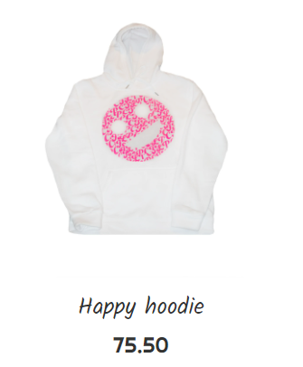

# Item

Item block which is actually a link.

## Props

| Prop Name | Type             | Default value | Description                                   |
|-----------|------------------|---------------|-----------------------------------------------|
| _id       | string           | 'none'        | Item's id                                     |
| name      | string           | 'T-shirt'     | The name                                      |
| price     | number           | 999           | The price                                     |
| img       | string           | 'none'        | Path to image                                 |
| type      | 'big' or 'small' | 'big'         | Type of the item, either for mobile or for PC |
| loadSelf  | bool             | false         | Allows to fetch data about the item           |

## State

| Prop Name | Type   | Default value | Description                                              |
|-----------|--------|---------------|----------------------------------------------------------|
| item      | object | null          | Object of an item, which is available after a data fetch |
