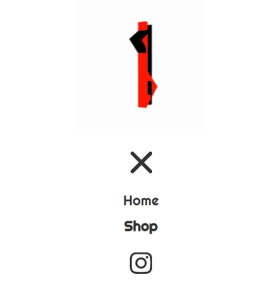

# SideBar

Side bar for the mobile devices. Actually it's top-down menu rather than "side bar".

## State

| Prop Name  | Type | Default value | Description                     |
|------------|------|---------------|---------------------------------|
| menuOpened | bool | false         | Wether the side menu is openned |
